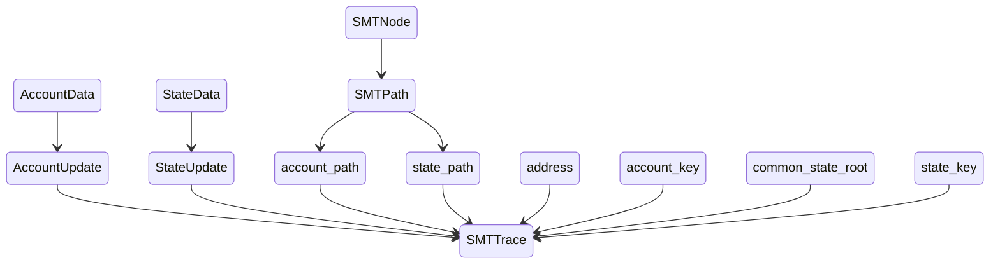

# MPT circuit doc/spec draft

This draft may serve as a preliminary version of a part of future documentation/spec.

Notice that the document is <i>not final</i> and may change due to potential errors in my understanding of the codebase or due to frequent changes of the codebase itself.

Corrections, suggestions and comments are very welcome at any time.

Thanks to @z2trillion for collaborating on drafting this documentation.

[zkTrie spec]: https://www.notion.so/scrollzkp/zkTrie-Spec-be31b03b7bcd4cdc8ece2dd3dca61928?pvs=4

[zkevm-circuits]: https://github.com/scroll-tech/zkevm-circuits

[zkTrie]: https://github.com/scroll-tech/zkevm-circuits/tree/develop/zktrie

## MPT table structure 

[MPT-table](https://github.com/scroll-tech/zkevm-circuits/blob/700e93c898775a19c22f9abd560ebb945082c854/zkevm-circuits/src/table.rs#L680) in zkevm-circuits has the following table layout

|address|storage_key|proof_type|new_root|old_root|new_value|old_value|
|-|-|-|-|-|-|-|
|||[MPTProofType](https://github.com/scroll-tech/zkevm-circuits/blob/700e93c898775a19c22f9abd560ebb945082c854/zkevm-circuits/src/table.rs#L645): NonceMod, BalanceMod, KeccakCodeHashExists, PoseidonCodeHashExists, CodeSizeExists, NonExistingAccountProof, StorageMod, NonExistingStorageProof|||||

The MPT table is constructed following this [zkTrie spec].

Each row of the MPT table reflects an 

- `MPTUpdate`
    - `key`: `AccountStorage` or `Account`, each one has its own data fields
    - `old_value` and `new_value`, change in value
    - `old_root` and `new_root`, change in trie root

Columns `address` and `storage_key` indicate the location where changes in account or storage happen.

## The purpose of the MPT circuit and its witness generation inside [zkevm-circuits]

MPT circuit aims at proving the correctness of the MPT table described above. This means its constraint system enforces a unique structure of the MPT (zkTrie) as described. 

When the MPT is changed due to account or storage updates, the MPT circuit must prove this update leads to the correct root change. We [encode](https://github.com/scroll-tech/zkevm-circuits/blob/c656b971d894102c41c30000a40e07f8e0520627/zkevm-circuits/src/witness/mpt.rs#L77) one step of `MPTUpdate` into an `SMTTrace` that carries [old_path, new_path] on the trie for account/storage. Here SMT stands for <i>Sparse Merkle Trie</i> (this confirmed by repo author @noel2004).

Both paths are from root to leaf, encoding the change of path in that step. This construction is done inside the [zkTrie] of the zkevm-circuits. 

<i>Note: Refactor logic (for account as an example) is [handle_new_state](https://github.com/scroll-tech/zkevm-circuits/blob/7e821a9386e6c9aad85ef40e669986305e04dc77/zktrie/src/state/witness.rs#L258) (update the trie according to `MPTProofType` category) -> [trace_account_update](https://github.com/scroll-tech/zkevm-circuits/blob/7e821a9386e6c9aad85ef40e669986305e04dc77/zktrie/src/state/witness.rs#L182) (provide old and new paths in the trie based on the update) -> [decode_proof_for_mpt_path](https://github.com/scroll-tech/zkevm-circuits/blob/7e821a9386e6c9aad85ef40e669986305e04dc77/zktrie/src/state/witness.rs#L398) (determine the path, which must start from root and end at either a leafnode or an empty node in the old/new trie based on the given key).</i>

<i>Note: In [zkTrie] the update is constructed according to `MPTProofType`, and for `MPTProofType::AccountDoesNotExist` and `MPTProofType::StorageDoesNotExist` the convention here is that the provided account/storage is empty both <b>before and after</b> the update. The proof of non-existence of the account before writing into or after deletion from the existing mpt, will be included as separate constraints that correspond to different types of non-existence proof (we call them type 1 and type 2 non-existence, see below).</i>

`SMTTrace` consists of the following hierarchy of notions:

- `SMTTrace`
    - `address`: 20-byte hex, the address of the account being updated.
    - `account_key`: 32-byte hex, the [hash of address](https://www.notion.so/scrollzkp/zkTrie-Spec-be31b03b7bcd4cdc8ece2dd3dca61928?pvs=4#2d4a954446e5433e9ff521a0461d10bb).
    - `account_path`: `SMTPath`, old and new
        - `SMTPath`: It is understood that this path has an order that goes from root node to leaf node.
            - `root`: hash
            - `leaf`: `SMTNode`
            - `path`: `Vec<SMTNode>`
            - `path_part`: partial key
        - `SMTNode`
            - `value`: hash
            - `sibling`: hash
    - `account_update`: `[Option<AccountData>; 2]`, old and new
        - `AccountData`
            - `nonce`
            - `balance`
            - `code_hash`: keccak code hash
            - `poisedon_code_hash`
            - `code_size`
        - Either account update can be `None`, if the `SMTTrace` is for an update to an account that previously doesn't exist, or the update for `MPTProofType::AccountDoesNotExist`.
    - `state_path`: `Option<[Option<SMTPath>; 2]>`. SMTPath's for **storage** trie. There are 5 possibilities for `None`/`Some(...)` here:
        1. `None`: the update doesn't touch the account's storage. I.e. the proof type matches `MPTProofType::{NonceChanged, BalanceChanged, CodeHashExists, PoseidonCodeHashExists, CodeSizeExists, AccountDoesNotExist}`
        2. `[None, None]` the storage slot for the update starts and ends with the value 0. Either the proof type is `MPTProofType::StorageDoesNotExist` or it is `MPTProofType::StorageChanged` and the new and old values are both 0. 
        3. `[Some(...), Some(...)]`: the proof type is `MPTProofType::StorageChanged` and the new and old values are non-zero.
        4. `[None, Some(...)]`: the proof type is `MPTProofType::StorageChanged` and the old value is 0 and the new value is non-zero.
        5. `[Some(...), None]`: the proof type is `MPTProofType::StorageChanged` and the old value is non-zero and the new value is non-zero.
    - `common_state_root`: 32-byte hex, hash. This is optional and is present iff `state_path` and `state_update` are both `None`. (It is not possible for only one of `state_path` or `state_update` to be `None`.)
    - `state_key`: optional [hash of **storage** key](https://www.notion.so/scrollzkp/zkTrie-Spec-be31b03b7bcd4cdc8ece2dd3dca61928?pvs=4#9d41b37c56be4f1d91301d083261f1ef). `None` if the update doesn't touch the account's storage.
    - `state_update`: `StateData`, old and new, reflecting update on storage
        - `StateData`
            - `key`
            - `value`

hierarchy looks like:

## MPT proofs as witnesses for the `feat/refactor` branch

During the witness assignment in mpt_update circuit, a sequence of mpt updates with each `update` being of type `SMTTrace` is provided. Each `update` is then [turned into](https://github.com/scroll-tech/mpt-circuit/blob/feat/refactor/src/types.rs) a `Proof` and then filled into the circuit as witnesses. Each `Proof` consists of the following components
    
- `Proof`
    - `claim`: A `Claim`
       - `Claim`
            - `old_root`
            - `new_root`
            - `address`
            - `kind`: `ClaimKind`
                - `Read`
                - `Write`
                - `IsEmpty`
    - `address_hash_traces`: vector of traces of hash obtained from `AccountPath` with path going from leaf to root. Each vector item is a list with components, that stands for a node in the path at the depth going from high (leaf end) to low (=0, root end). Components are 
        - `direction`: bool, this is corresponding to `account_key`, left or right that this node is with respect to its father (not sure? but  @z2trillion has the same opinion)
        -  `open_value`: `Fr` field element, old hash at this node, i.e. for old path
        -  `close_value`: `Fr` field element, new hash at this node, i.e. for new path
        -  `sibling`: `Fr` field element, sibling node's hash
        -  `is_open_padding`: bool, true if this node is empty for old path 
        -  `is_close_padding`: bool, true if this node is empty for new path 
    - `leafs`: `[LeafNode; 2]`, for old and new path
        - `LeafNode`
            - `key`
            - `value_hash`
    - `old_account_hash_traces`: Vector with item in `[[Fr; 3]; 6]`. For non-empty account
        - `[codehash_hi, codehash_lo, h1=hash(codehash_hi, codehash_lo)]`
        - `[h1, storage_root, h2=hash(h1, storage_root)]` 
        - `[nonce, balance, h3=hash(nonce, balance)]`
        - `[h3, h2, h4=hash(h3, h2)]`
        - `[1, account_key, h5=hash(1, account_key)]`
        - `[h4, h5, h6=hash(h4, h5)]`
    For empty account
        - `[0,0,0]`
        - `[0,0,0]` 
        - `[0,0,0]`
        - `[0,0,0]`
        - `[1, leaf.key, h5=hash(1, leaf.key)]`
        - `[h5, leaf.value_hash, h6=hash(h5, leaf.value_hash)]`
    -    `new_account_hash_traces`:same as above, but for the new account.
    - `storage_hash_traces`: same as address_hash_traces, but for storage
    - `storage_key_value_hash_traces`: `Option<[[[Fr; 3]; 3]; 2]>`, old and new of the following list
        - `[key_high, key_low, h0=hash(key_high, key_low)]`
        - `[value_high, value_low, h1=hash(value_high, value_low)]`
        - `[h0, h1, hash(h0, h1)]`

Circuit configures constraints for each [`MPTProofType`](https://github.com/scroll-tech/mpt-circuit/blob/2cc63d2b765a20cd12136d1df675052c9353a582/src/mpt_table.rs#L231)
    
- `MPTProofType`
    - `NonceChanged` = 1
    - `BalanceChanged`
    - `CodeHashExists`: keccak codehash updated
    - `PoseidonCodeHashExists`: poseidon codehash updated 
    - `CodeSizeExists`: code size updated
    - `AccountDoesNotExist`: non exist proof for account
    - `AccountDestructed`: this does not match what is in zkevm-circuits?
    - `StorageChanged`
    - `StorageDoesNotExist`
    

    
## Circuit layout and constraints

<i>TODO: The circuit layout columns may have not been finalized and will be constantly updated based on recent pushes to the git repo branch.</i>

|old_hash|new_hash|old_value|new_value|proof_type|address|storage_key_rlc|segment_type|path_type|depth|key|other_key|other_key_hash|other_leaf_data_hash|direction|sibling|upper_128_bits|
|-|-|-|-|-|-|-|-|-|-|-|-|-|-|-|-|-|
|node's open hash|node's close hash|node's open value|node's close value|MPTProofType|||Start, AccountTrie, AccountLeaf0, AccountLeaf1, AccountLeaf2, AccountLeaf3, AccountLeaf4, StorageTrie, StorageLeaf0, StorageLeaf1|Common, ExtensionOld, ExtensionNew|depth increase from root to leaf, from current row to next row|provided key|match provided key with existing mpt path key, until reaching leafnode, obtain resulting key. For type 1 non-existence proof, this key is different from provided key, for type 2 non-existence proof, this key is the same as provided key|hash(1, other_key) if other_key matches provided key, else is 0|hash of the leaf/empty node pointed by other key|direction must match key|sibling node's hash|most significant 128 bits of address or storage key|

Each circuit row represents the mpt update (from old to new) of a path from root to leaf, at a certain depth (depth of root is 0). So each row represents only one node (virtual node in case it does not exist). The row offset order `previous --> current --> next` indicates an increase of depth towards leafnode.

The configuration changes to the MPT are characterized by the following two columns: 

(1) `PathType`: This characterizes topological structural change. It includes `PathType::Start`, `PathType::Common`, `PathType::ExtensionOld` and `PathType::ExtensionNew`; 

(2) `SegmentType`: This characterizes data field (which forms the trie's leafnode hash) change. It includes `SegmentType::Start`, `SegmentType::AccountTrie`, `SegmentType::AccountLeaf0`-`SegmentType::AccountLeaf4`, `SegmentType::StorageTrie`, `SegmentType::StorageLeaf0`-`SegmentType::StorageLeaf1`.

In both of the above two-column witnesses, `Start` is used as a boundary marker between updates. This means each circuit row with a `Start` indicates a new MPT update.

### Topological structure changes to the trie, their corresponding mpt operations and account/storage types

Operations to the trie can be classified as 

(1) <i>modify</i>: an account/storage slot is being changed. The account/storage under this operation is named <b>type 0</b>, i.e., type 0 account/storage are in the MPT. This means that they're non-emtpy, i.e. at least one of their fields is non-zero. Figure below:

(2) <i>insert to/delete from append</i>: an account/storage slot is inserted to the MPT as append, i.e. it forms a new leafnode that previously does not exist even as empty nodes (<i>insert to append</i>), or it is deleted from an appended leaf, i.e., after deletion there will be no node (including empty node) left (<i>delete from append</i>). The account/storage under this operation is named <b>type 1</b>, i.e., type 1 account/storage is empty. Where they could be in the MPT, there is instead a leaf node that maps to another non-empty account/storage. Figure below (for insert case, and delete case just swap old and new): 

Notice that the zkTrie adds only one bit of common prefix at each level of its depth. It also applies the optimization that replaces subtrees consisting of exactly one leaf with a single leaf node to reduce the tree height. This means that when inserting/deleting new account as append, it may happen that an extension happens with some intermediate nodes that provide key prefix bits, either for the old path or for the new path. It is constrained that at all the new siblings added are empty nodes. 

(3) <i>insert to/delete from fill</i>: insert an account/storage slot to fill in an empty node (<i>insert to fill</i>) as well as delete an account/storage slot from a filled leafnode and leaves with an empty node (<i>delete from fill</i>). The account/storage under this operation is named <b>type 2</b>, i.e., type 2 account/storage are also empty. Where they could be in the MPT, there is instead an empty node. Figure below (for insert case, and delete case just swap old and new):

### PathTypes

#### PathType::Common

`PathType::Common` refers to the situation that the old and new path share the same topological configuration.

This can correspond to the topological configuration change on the whole path in the modify operation, or the common path (not extended one) of the insert to/delete from append, or the insert to/delete from fill operations. 

#### PathType::ExtensionNew

`PathType::ExtensionNew` refers to the situation that the new path extends the old path in its topological configuration.

This can correspond to the extended part of the path in insert to append, insert to fill operations.

#### PathType::ExtensionOld

`PathType::ExtensionOld` refers to the situation that the old path extends the new path in its topological configuration.

This can correspond to the extended part of the path in delete from append, delete from fill operations.

#### Change of PathType along a path

Each circuit row will be assigned a PathType at witness generation. Along a path (old/new) provided by the `Proof`, each node will correspond to a row in the circuit. So `PathType` can change from `Common` to `ExtensionOld(New)` when hitting the extended part of the trie. This also includes the case when a type 2 account/storage is inserted/deleted, where the empty node pointed by the key will be extended to a leafnode.

#### <i>Discussion: Can we come up with a simpler way of looking at all the PathTypes?</i>
<i>In fact, if we do not compress subtrees with empty nodes as in the [zkTrie spec], then we can combine the two subcases in account addition case (or account deletion case). Here the previous figure for `PathType::ExtensionNew` in account addition case becomes the following

    However, using the empty-node compression in the current [zkTrie spec] will result in an extension and we have to work with various PathTypes. This is a trade-off, though, from the above argument based on whether the old path hits a leaf or an empty node, we know that we exhausted all path types.</i>
    

### Type 1 and Type 2 non-existence proofs

These cases of non-existence proofs do <b>not</b> really correspond to `MPTProofType::AccountDoesNotExist` or `MPTProofType::StorageDoesNotExist`, but are related to non-existence before writing into or after deletion from existing mpt. 

There are 2 cases to constrain based on the path directed by the provided non-existing key (coming from hash of account address):

- <b>Type 1 non-existence proof</b> (insert to append/delete from append): the path ended at a leaf node. The illustration figure shown below:

In this case, due to our construction of the old and new paths of `SMTTrace`, the old path (when inserting)/new path (when deleting) must be directed to this leaf node. The prefix key provided by the old/new path must end at a bit position <i>before</i> the last bit of the leaf key that is to be proved non-exist. So we constrain that the non-existing account/storage must have its key that is not equal to the key at this leaf node. Circuit columns `other_key`, `other_key_hash`, `other_leafnode_hash` and an IsEqualGadget `key_equals_other_key` are used to provide witness to these constraints and to constrain.

- <b>Type 2 non-existence proof</b> (insert to fill/delete from fill): the path ended at an empty node. The illustration figure shown below:

In this case, due to our construction of the old and new paths of `SMTTrace`, the old path (when inserting)/new path (when deleting) must be directed to this empty node. So we constrain the emptiness of these nodes. Circuit provides two IsZeroGadgets `old_hash_is_zero` and`new_hash_is_zero` to constrain this case.

### SegmentTypes

According to the [zkTrie spec], the leafnode hash is calculated by the formula
`leafNodeHash = h(h(1, nodeKey), valueHash)`

#### Account SegmentTypes

For account, the formula for `valueHash` is

So we introduce account `SegmentType` as shown in the following figure

#### Storage SegmentTypes
For storage, the formula for `valueHash` is
`valueHash = h(storageValue[0:16], storageValue[16:32])`, so we have the following figure

#### Expanding the trie leaf via SegmentTypes during circuit witness generation

The above expansions are beyond what the original trie defined in [zkTrie spec] can have, where the expansion of the trie will only be up to leafnodes that are classified into `AccountTrie` or `StorageTrie`, i.e.  trie-type segments. The leaf-type segments (non-trie segments) are witnesses generated <i>inside</i> the circuit (parsed from `SMTTrace`), and the trie-like structure shown above are just imaginary/virtual which only lives in the circuit. So such common constraints as key is 0 and depth is 0 for non-trie segments must be enforced in the circuit constraint system. 

The `PathType` used inside the circuit is also corresponding to this expanded trie including leaf-type segments (non-trie segments). For example, in the case of insert to fill operation, `PathType` changes from `Common` to `ExtensionNew` at the empty node that is filled by a new leaf, and the path continues to the specific account/storage field. So constraints for `PathType::ExtensionNew(Old)` must be discussed separately for trie and non-trie segment cases.

### Constraints 

#### Shared Constraints
for every row:
- When `SegmentType==AccountTrie` or `StorageTrie` (`is_trie` is true):
    - `key` at `depth` matches `direction`
    - `depth_curr==depth_prev+1`
    - when `PathType::Common`, `other_key` at `depth` matches `direction`
    
- When `SegmentType` is any other (non-trie) type (`is_trie` is false):
    - `key==0`
    - `depth==0` 

- upper 128 bits of account/storage value is 16 bytes 

#### PathType::Common
on rows with `PathType::Common`:
- for the old common path, `old_hash_previous==poisedon_hash(old_hash_left_child, old_hash_right_child)`
- for the new common path, `new_hash_previous==poisedon_hash(new_hash_left_child, new_hash_right_child)`
- for type 2 non-existence proof, common path includes an empty node as leafnode. So we provide constraints for this case
    - if next row has `PathType::ExtensionNew` and `SegmentType::AccountTrie0`, then current row has `old_hash==0`
    - if next row has `PathType::ExtensionOld` and `SegmentType::AccountTrie0`, then `new_hash==0`

#### PathType::ExtensionNew
on rows with `PathType::ExtensionNew`:
- `old_value==0`
- old path has `old_hash` kept unchanged on the extended path
- new path has `new_hash=poisedon_hash(leftchild, rightchild)`
- on trie segments (`is_trie==true`)
    - In case next`SegmentType` is still trie type (`is_final_trie_segment==false` )
        - For the extended part of the path, sibling is zero
    - In case next `SegmentType` is non-trie (leaf) type (`is_final_trie_segment==true`): 
        - sibling is old leaf hash for final new extension path segments
- on non-trie segments
    - when `SegmentType::AccountLeaf0`
        - `other_key_hash=poisedon(1, other_key)` 
        - `old_hash_prev==poisedon(other_key_hash, other_leaf_data_hash)`
        - we use `key!=other_key` to check type 1 non-existence (type 1 account), in case `key!=other_key`, constrain that `old_value==0`

<i>TODO: Need to think about if there are missing constraints here.</i>

#### MPTProofType::NonceChanged

on rows with `MPTProofType::NonceChanged`:

- Constrain allowed `SegmentType` transitions:
    - `Start -> [Start, AccountTrie, AccountLeaf0]`
    - `AccountTrie -> [AccountTrie, AccountLeaf0, Start]`
    - `AccountLeaf0 -> [Start, AccountLeaf1]`
    - `AccountLeaf1 -> AccountLeaf2`
    - `AccountLeaf2 -> AccountLeaf3`
    - `AccountLeaf3 -> Start`
- Constraints correspond to specific `SegumentType` for the particular row
    -  `AccountLeaf0`
        - `direction==1`
        - `key_prev==poisedon(address_lo, address_hi)` (see [here](https://www.notion.so/scrollzkp/zkTrie-Spec-deprecated-be31b03b7bcd4cdc8ece2dd3dca61928?pvs=4#2d4e62a92ba04ec98fc2586bf69a549f))
        - `sibling==poisedon(1, key_prev)`
    -  `AccountLeaf1`
        - `direction==0`
    -  `AccountLeaf2`
        - `direction==0`
    -  `AccountLeaf3`
        - `direction==0`
        - in case `PathType::Common`:
            - `value` (=`nonce`) is 8 bytes, old and new
            - `code_size` (=(`hash`-`value`)$/2^{64}$, since `hash` is now `nonce||codesize||0` from LSB to MSB and `nonce` is 8 bytes, `codesize` is 8 bytes and `0` is 16 bytes) is 8 bytes, old and new
            - `code_size` does not change between old and new
        - in case `PathType::ExtensionNew`:
            - `value` (=`nonce`) is 8 bytes for new
            - `code_size` is 0 for new
        - in case `PathType::ExtensionOld`: 
            - `value` (=`nonce`) is 8 bytes for old
            - `code_size` is 0 for old
    -  `AccountLeaf4, StorageTrie, StorageLeaf0, StorageLeaf1` 
        -  unreachable segment type for nonce update

#### MPTProofType::CodesizeExists

on rows with `MPTProofType::CodesizeExists`:

- same structure of constraints as in the `MPTProofType::NonceChanged` case. The only difference is that instead of computing `codesize` from `nonce` and `hash`, compute `nonce` from `codesize` and `hash` and then constrain.

#### MPTProofType::BalanceChanged

on rows with `MPTProofType::BalanceChanged`:

- same structure of constraints as in the `MPTProofType::NonceChanged` case. The only difference is that 
    - direction for `AccountLeaf0-4` becomes `[1, 0, 0, 1]`
    - At `AccountLeaf3`, constrain that `old_hash==old_balance (old_value)`  for `PathType::{Common, ExtensionOld}` and `new_hash==new_balance (new_value)` for `PathType::{Common, ExtensionNew}`

#### MPTProofType::PoisedonCodehashExists

on rows with `MPTProofType::PoisedonCodehashExists`:

- same structure of constraints as in the `MPTProofType::NonceChanged` case. The only difference is that 
    - direction for `AccountLeaf0-4` becomes `[1,1]`
    - At `AccountLeaf1`, constrain that `old_hash==poisedon_code_hash (old_value)`  for `PathType::{Common, ExtensionOld}` and `new_hash==poisedon_code_hash (new_value)` for `PathType::{Common, ExtensionNew}`
